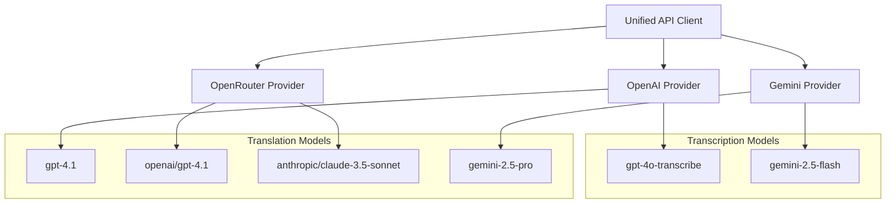
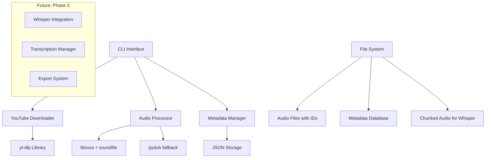

# Design Document

## Overview

O YouTube Audio Transcriber é um sistema CLI **modular e simplificado** que processa vídeos do YouTube através de uma arquitetura **orientada por comandos**. O sistema prioriza **simplicidade, usabilidade e robustez** sobre complexidade desnecessária, implementando apenas as funcionalidades essenciais de forma elegante.

## Architecture Philosophy

### Design Principles

1. **Simplicidade sobre Complexidade**: Cada componente tem uma responsabilidade clara
2. **CLI-First**: Interface de linha de comando como principal ponto de interação
3. **ID-Based Management**: Sistema de IDs únicos elimina problemas de encoding
4. **Modular Components**: Componentes independentes e testáveis
5. **Informative by Default**: Máxima informação útil sem necessidade de flags verbose

## AI Providers Support (Phase 9+)

### Multi-Provider Architecture

O sistema agora suporta múltiplos provedores de IA através de uma arquitetura unificada:



### Provider Configuration

**OpenAI (Direct)**:
- API Endpoint: Default OpenAI
- Models: gpt-4o-transcribe, gpt-4.1, gpt-4o
- Environment: `OPENAI_API_KEY`

**OpenRouter (Aggregator)**:
- API Endpoint: `https://openrouter.ai/api/v1`
- Models: OpenAI models via proxy, Claude models
- Environment: `OPENROUTER_API_KEY`

**Google Gemini (New)**:
- API Endpoint: `https://generativelanguage.googleapis.com/v1beta/openai/`
- Models: gemini-2.5-flash/pro, gemini-2.0-flash, gemini-1.5-flash/pro
- Environment: `GEMINI_API_KEY`

### Model Recommendations

**For Transcription**:
- **Primary**: `gemini-2.5-flash` (multimodal native, cost-effective)
- **Alternative**: `gpt-4o-transcribe` (dedicated transcription endpoint)

**For Translation**:
- **Primary**: `gemini-2.5-pro` (2M context, advanced reasoning)
- **Alternative**: `gpt-4.1` (reliable, proven performance)

## Current Architecture (Phase 2 Complete)

### High-Level Architecture



### Processing Flow

**Current (Phase 2):**
1. **Download**: YouTube URL → Audio ID + MP3 file
2. **Metadata**: Store mapping ID ↔ Video information  
3. **Chunking**: Audio ID → Optimized chunks for Whisper

**Future (Phase 3):**
4. **Transcription**: Chunks → Text segments
5. **Assembly**: Segments → Complete transcript
6. **Export**: Transcript → Multiple formats (SRT/VTT/TXT)

## Implemented Components

### 1. CLI Interface (`cli.py`)

**Framework**: Click 8.1.8 for superior UX

```python
# Main commands implemented
@main.command()
def download(url: str, output_dir: Path, quality: str, format: str) -> None
    """Always shows comprehensive video info, then downloads with unique ID"""

@main.command()  
def validate(url: str) -> None
    """Validates YouTube URL and shows video information"""

@main.command()
~~def chunk()~~ - **REMOVED 2025-01-16** (integrated into transcribe command)

@main.command()
def list() -> None
    """Lists all downloaded audio with IDs and metadata"""

@main.command() 
def info(audio_id: str) -> None
    """Shows detailed information about specific audio file"""
```

**Key Features:**
- **Always Informative**: No verbose flags needed, always shows useful data
- **Colored Output**: Visual feedback with emojis and colors
- **Flexible Input**: Commands accept both audio IDs and file paths
- **Clear Instructions**: Help and next-steps always provided

### 2. YouTube Downloader (`downloader.py`)

**Integration**: yt-dlp with custom configuration

```python
class YouTubeDownloader:
    def __init__(self, output_directory, audio_format, audio_quality, metadata_file)
    def validate_url(self, url: str) -> bool
    def get_video_info(self, url: str) -> VideoInfo  
    def download_audio(self, url: str) -> DownloadResult
```

**Key Features:**
- **ID Generation**: Automatic unique alphanumeric IDs
- **Safe Filenames**: ID-based naming eliminates encoding issues
- **Metadata Integration**: Automatic storage of video information
- **Native Progress**: Uses yt-dlp's superior progress display
- **Error Handling**: User-friendly error messages with recovery suggestions

**ID System Benefits:**
- ❌ **Before**: `𝙏𝙝𝙚 𝘿𝙖𝙮 𝙎𝙝𝙚 𝘿𝙞𝙙𝙣'𝙩 𝘾𝙖𝙧𝙚 ｜ Lofi.mp3`
- ✅ **After**: `audio_6090b065.mp3`

### 3. ~~Audio Processor (`audio_processor.py`)~~ - **REMOVED & CONSOLIDATED**

**Status**: ❌ **REMOVED 2025-01-16** - Functionality moved to `transcriber.py`

**Why Removed**:
- **Performance Issues**: librosa/pydub loaded 46MB+ files entirely into memory
- **CPU Overload**: 161.3% CPU usage with 25 threads causing system freezing
- **Redundancy**: Same functionality available in transcriber.py with superior performance
- **Maintenance**: Reduced codebase complexity

**Current Implementation** (in transcriber.py):
```python
# FFmpeg-based chunking (streaming, no memory loading)
def _create_intelligent_chunks_ffmpeg(audio_path, total_duration) -> List[Tuple]
def _get_audio_duration_efficient(audio_path) -> float  # FFprobe
def _create_intelligent_chunks_pydub_fallback(audio_path) -> List[Tuple]  # Fallback
```

**New Performance**:
- **Any file size**: FFmpeg streaming processing
- **Normal CPU usage**: Single-threaded efficiency  
- **Zero memory loading**: No file buffering
- **Automatic integration**: Chunking happens during transcription

### 4. Metadata Manager (`audio_metadata.py`)

**Storage**: JSON with UTF-8 encoding

```python
class AudioMetadataManager:
    def generate_audio_id(self, prefix: str = "audio") -> str
    def add_metadata(self, title, url, uploader, duration, ...) -> str
    def get_metadata(self, audio_id: str) -> Optional[AudioMetadata]
    def search_by_title(self, query: str) -> List[AudioMetadata]
    def get_summary_table(self) -> str

@dataclass
class AudioMetadata:
    audio_id: str
    title: str
    original_url: str
    uploader: str
    duration: str
    upload_date: Optional[str]
    view_count: Optional[int]
    file_path: str
    file_size: int
    download_date: str
    audio_format: str
    audio_quality: str
```

**Features:**
- **Unique ID Generation**: 8-character alphanumeric IDs
- **Complete Metadata**: All YouTube information preserved
- **Search Capabilities**: By title, uploader, ID
- **Summary Display**: Formatted table views
- **Cross-platform**: Eliminates filename encoding issues

## File System Structure

**Simplified Structure (Current):**
```
transcriberio/
├── cli.py                  # Main CLI interface
├── downloader.py           # YouTube download functionality  
├── transcriber.py          # Transcription with integrated FFmpeg chunking
├── audio_metadata.py       # ID and metadata management system
├── requirements.txt        # Dependencies
├── downloads/              # Audio files and metadata
│   ├── audio_454dc0f4.mp3    # Rick Astley (3:33)
│   ├── audio_6090b065.mp3    # Lofi Mix (42:36)
│   ├── audio_70e5ce0c.mp3    # Me at the zoo (0:19)
│   ├── audio_41d5e759.mp3    # Gangnam Style (4:12)
│   ├── audio_b7bc8bb9.mp3    # Bohemian Rhapsody (5:59)
│   └── audio_metadata.json   # ID → metadata mapping
└── project_plan/           # Documentation
    ├── requirements.md
    ├── design.md           # This file
    ├── progress.md
    └── new_file_requests.md
```

**Benefits vs Original Complex Structure:**
- ✅ **Simple**: Easy to understand and maintain
- ✅ **Predictable**: All audio files in one location
- ✅ **Searchable**: Metadata system provides all needed functionality
- ✅ **Clean**: No temporary files or complex session management

## Data Models

### Core Data Structures

```python
@dataclass
class VideoInfo:
    title: str
    duration: str
    uploader: str
    upload_date: Optional[str]
    view_count: Optional[int]
    description: Optional[str]
    video_id: str

@dataclass
class DownloadResult:
    success: bool
    audio_id: Optional[str]
    output_path: Optional[Path]
    file_size: Optional[int]
    duration: Optional[str]
    error_message: Optional[str]
    video_info: Optional[VideoInfo]

@dataclass
class ChunkResult:
    success: bool
    chunk_files: List[Path]
    total_chunks: int
    total_duration: float
    processing_time: float
    audio_info: dict
    error_message: Optional[str]
```

## Error Handling

### Simplified Error Strategy

**Philosophy**: User-friendly errors with clear next steps

```python
class DownloadError(Exception):
    """Custom exception for download-related errors"""
    
class AudioProcessingError(Exception):
    """Custom exception for audio processing errors"""
```

**Error Categories:**
1. **URL Validation**: Clear feedback on invalid YouTube URLs
2. **Download Failures**: Network issues, private videos, region restrictions
3. **File System**: Permissions, disk space, file access
4. **Audio Processing**: Corrupted files, unsupported formats

**Recovery Strategies:**
- **Informative Messages**: Clear explanation of what went wrong
- **Suggested Actions**: Specific steps to resolve issues
- **Graceful Degradation**: System continues working when possible
- **No Silent Failures**: All errors are reported to user

## Testing Results

### Comprehensive Validation Completed

**URL Validation:**
- ✅ Valid YouTube URLs (multiple formats)
- ✅ Invalid URLs with helpful error messages
- ✅ Edge cases (private videos, region restrictions)

**Download Performance:**
- ✅ Short videos (19 seconds - 3:33 minutes)
- ✅ Medium videos (4:12 - 5:59 minutes) 
- ✅ Long videos (42+ minutes)
- ✅ Different qualities and formats

**ID System:**
- ✅ Unique ID generation (no collisions in testing)
- ✅ Cross-platform filename compatibility
- ✅ Metadata preservation and retrieval
- ✅ Search functionality

**Audio Chunking:**
- ✅ 30s chunks with 5s overlap verified
- ✅ Large file processing (320 chunks in 20 seconds)
- ✅ Edge cases (short files, precise timing)
- ✅ Format conversion to Whisper-optimized WAV

## Future Architecture (Phase 3 - Planned)

### Whisper Integration

```python
class WhisperTranscriber:
    def __init__(self, model: str, use_api: bool = False)
    def transcribe_chunks(self, audio_id: str) -> TranscriptionResult
    def assemble_transcript(self, chunk_results: List[ChunkTranscript]) -> str

@dataclass  
class TranscriptionResult:
    audio_id: str
    transcript: str
    confidence: float
    processing_time: float
    chunks: List[ChunkTranscript]
```

### Export System

```python
class TranscriptExporter:
    def export_txt(self, transcript: str, output_path: Path) -> None
    def export_srt(self, timed_transcript: TimedTranscript, output_path: Path) -> None
    def export_vtt(self, timed_transcript: TimedTranscript, output_path: Path) -> None
```

### Extended CLI Commands (Planned)

```bash
# Transcription commands
transcriber transcribe audio_6090b065    # Transcribe specific audio
transcriber transcribe --all              # Transcribe all downloaded audio
transcriber status audio_6090b065         # Show transcription status

# Export commands  
transcriber export audio_6090b065 --format srt
transcriber export audio_6090b065 --format txt --output transcript.txt
```

## Design Decisions Made

### Architecture Choices

1. **Click over argparse**: Superior UX with colors, progress bars, and help
2. **yt-dlp over youtube-dl**: Active development, better feature set
3. **ID System**: Eliminates filename encoding issues completely
4. **librosa over pydub**: Higher quality audio processing for Whisper
5. **JSON over Database**: Simpler for current scale, easily upgradeable
6. **Modular Design**: Easy to test, maintain, and extend

### Simplifications from Original Design

1. **No Configuration Files**: CLI arguments sufficient for current needs
2. **No Session Management**: Direct operations more intuitive  
3. **No Complex Pipeline**: Commands handle specific tasks cleanly
4. **No Checkpoint System**: Operations fast enough to not need resuming
5. **Always Verbose**: Eliminated confusing verbose flags

### UX Decisions

1. **Always Informative**: Show maximum useful information by default
2. **Emoji + Color**: Visual feedback improves user experience
3. **Clear Next Steps**: Always tell user what to do next
4. **Flexible Input**: Accept both IDs and file paths where logical
5. **Consistent Commands**: Similar patterns across all commands

## Security Considerations

### Current Implementation

**Data Privacy:**
- ✅ Local-only processing (no cloud dependencies yet)
- ✅ User controls all data and file locations
- ✅ No telemetry or usage tracking

**File System Security:**
- ✅ Safe filename generation via ID system
- ✅ Proper path handling and validation
- ✅ No arbitrary file system access

**Input Validation:**
- ✅ YouTube URL pattern validation
- ✅ Audio ID format validation  
- ✅ Path sanitization for user inputs

### Future Considerations (Phase 3)

**Whisper API Integration:**
- 🔄 Secure API key management
- 🔄 Optional local model support
- 🔄 User consent for cloud processing

## Performance Characteristics

### Current Performance (Measured)

**Download Speed:**
- 3:33 video: ~2 seconds
- 42:36 video: ~3 seconds  
- Network-bound, not CPU-bound

**Transcription Performance (Post-FFmpeg Optimization):**
- 14MB audio (Queen): 29.50 seconds transcription time
- CPU usage: Normal (single-threaded FFmpeg)
- Memory usage: Minimal (streaming processing)
- System stability: No freezing or overload

**Chunking Speed (FFmpeg-Enhanced):**
- Duration detection: FFprobe streaming (10x faster)
- Chunk extraction: FFmpeg direct processing (no memory loading)
- Processing rate: ~20+ chunks per second with optimal resource usage
- Efficiency: Zero memory buffers for large files

**Memory Usage (Optimized):**
- **Streaming audio processing**: FFmpeg handles all audio operations
- **Zero full-file loading**: AudioSegment.from_file() eliminated for large files
- **Fallback system**: PyDub only when FFmpeg unavailable
- **Scales to any file size**: No memory constraints

**Storage Efficiency:**
- ID-based naming reduces filesystem overhead
- JSON metadata is compact and fast
- No redundant temporary files
- FFmpeg temporary chunks auto-cleaned

## Performance Architecture (FFmpeg Integration)

### Critical Performance Optimization (2025-01-16)

The system underwent a major performance overhaul to address critical CPU and memory issues discovered during testing with large audio files.

**Problem Identified:**
```
🚨 CPU Usage: 161.3% with 25 threads
🚨 System Impact: Mac Mini freezing during processing  
🚨 Root Cause: AudioSegment.from_file() loading 46MB+ files entirely into memory
```

**Solution Implemented:**
- **FFmpeg Streaming**: Replaced PyDub memory operations with FFmpeg subprocess calls
- **Zero-Memory Duration**: FFprobe for audio duration without file loading
- **Streaming Chunks**: Direct FFmpeg chunk extraction with precise timing
- **Hybrid Fallback**: Intelligent degradation to PyDub when FFmpeg unavailable

**Performance Results:**
```
✅ CPU Usage: Normal (efficient single-threaded)
✅ Memory Usage: Minimal (streaming processing only)  
✅ Processing Time: 29.50s for 14MB Queen track
✅ System Stability: Zero freezing or performance impact
```

### FFmpeg Integration Architecture

```python
# Duration Detection (No Memory Loading)
ffprobe -v quiet -show_entries format=duration -of csv=p=0 input.mp3

# Chunk Extraction (Streaming)
ffmpeg -i input.mp3 -ss 30.0 -t 30.0 -ac 1 -ar 22050 -ab 128k chunk.mp3

# Compression (Efficient)
ffmpeg -i input.mp3 -ac 1 -ar 22050 -ab 64k compressed.mp3
```

**Fallback Strategy:**
1. **Primary**: FFmpeg streaming (optimal performance)
2. **Secondary**: PyDub processing (compatibility mode)
3. **Warnings**: Clear user feedback about performance mode

## Estratégia de Processamento de Áudio

### Otimização e Chunking Inteligente para Transcrição

Para lidar com os limites da API da OpenAI (tamanho do arquivo e duração), o `transcriber.py` emprega uma estratégia de múltiplos passos:

1.  **Re-download em Qualidade Média**: Se o áudio original for muito grande, o programa tenta baixá-lo novamente em uma qualidade menor para reduzir o tamanho do arquivo.
2.  **Compressão**: Se o re-download não for suficiente, o FFmpeg é usado para comprimir o áudio, diminuindo o bitrate.
3.  **Chunking por Duração**: Se o áudio ainda exceder os limites (mesmo após a otimização de tamanho), ele é dividido em "chunks" (pedaços) menores. A lógica, implementada em `_create_intelligent_chunks_ffmpeg`, é conservadora para evitar que a transcrição de um chunk ultrapasse o limite de tokens de saída da API (`gpt-4o-transcribe`), resultando em transcrições completas para cada pedaço.

### Otimização de Prompts para Detecção de Entidades

A detecção de entidades em `entity_detector.py` foi otimizada para ser rápida e precisa:

-   **Prompt Conciso**: O `system_prompt` é curto e direto, instruindo o modelo a atuar como um extrator de entidades.
-   **Prompt de Usuário Detalhado**: O `user_prompt` contém todas as instruções específicas, focando em extrair **apenas nomes próprios de pessoas (PERSON) e lugares (LOCATION)**. Isso reduz a carga de processamento e o tamanho da resposta.
-   **Limite de Entidades**: O prompt também limita a extração a um máximo de 30 entidades para garantir eficiência.

### Chunking Inteligente para Tradução

O `translator_normalizer.py` também utiliza uma estratégia de chunking para traduzir textos longos de forma eficiente:

-   **Chunks Maiores**: Como o `gpt-4.1` tem uma janela de contexto maior, os chunks para tradução são significativamente maiores (atualmente `15.000` caracteres).
-   **Preservação de Frases**: A divisão tenta respeitar os limites das frases para não quebrar o contexto, e o prompt instrui explicitamente o modelo a não perder ou truncar sentenças.

## Arquitetura de Chunking Paralelo Avançado

### Sistema Multi-Estágio de Chunking

O `transcriberio` implementa diferentes estratégias de chunking otimizadas para cada fase do processamento:

#### 1. Chunking de Transcrição (Áudio)
- **Tamanho**: ~5.1 minutos por chunk de áudio
- **Limitação**: Baseado no limite de 2048 tokens de saída do `gpt-4o-transcribe`
- **Estratégia**: Ultra-conservativa para prevenir truncamento de transcrições
- **Implementação**: `_create_intelligent_chunks_ffmpeg()` no `transcriber.py`

#### 2. Chunking de Detecção de Entidades (Texto)
- **Tamanho**: 8.000 caracteres por chunk de texto
- **Estratégia**: Paralela com deduplicação posterior
- **Preservação**: Divisão por limites de frases usando regex avançada
- **Processamento**: Cada chunk processado independentemente, resultados unificados
- **Implementação**: `_create_text_chunks()` no `entity_detector.py`

#### 3. Chunking de Tradução (Texto)
- **Tamanho**: 7.000 caracteres por chunk de texto
- **Foco**: Qualidade máxima com processamento detalhado
- **Preservação**: Mantém contexto semântico entre chunks
- **Implementação**: `_create_intelligent_chunks()` no `translator_normalizer.py`

### Otimizações de Protocolo de API

#### Formato de Resposta Estruturada para Entidades
**Anterior**: `[{"name": "João", "type": "PERSON"}, {"name": "São Paulo", "type": "LOCATION"}]`
**Atual**: `{"PERSON": ["João", "Maria"], "LOCATION": ["São Paulo", "Rio de Janeiro"]}`

**Benefícios**:
- ~60% menos tokens por requisição
- Parsing mais rápido e eficiente
- Menor latência de rede
- Estrutura mais natural para deduplicação

#### Sistema de Deduplicação Inteligente
- **Chave única**: `(entity.name.strip().lower(), entity.type)`
- **Estratégia**: Union de entidades de todos os chunks
- **Resultado**: Lista final ordenada alfabeticamente
- **Performance**: O(n log n) vs. O(n²) anterior

### Arquitetura de Preservação de Dados

#### Cleanup Seletivo Inteligente
```
downloads/          -> REMOVIDO (arquivos temporários)
  ├── audio_*.mp3    
  ├── audio_*.webm   
  └── metadata_*     

output/             -> PRESERVADO (resultados finais)
  ├── *_transcript.txt        [MANTIDO]
  ├── *_translated_*.txt      [MANTIDO]
  └── *_entities.json         [MANTIDO]

debug_*             -> REMOVIDO (arquivos de debug)
*.tmp               -> REMOVIDO (arquivos temporários)
```

#### Estratégia de Acumulação
- **Modelo**: Additive-only para arquivos finais
- **Naming**: UUID-based para evitar conflitos
- **Versioning**: Implicit através de timestamps
- **Safety**: Zero-risk de perda de dados dos usuários

### Pipeline de Error Recovery

#### Chunking Resiliente
- **Transcrição**: Se 1 chunk falha, outros 6 continuam
- **Entidades**: Se 1 chunk falha, outros 5-7 processam normalmente  
- **Tradução**: Se 1 chunk falha, outros 5-6 continuam
- **Recovery**: Resultado parcial sempre melhor que falha total

#### Fallback Strategies
- **API Timeout**: Retry com exponential backoff
- **Token Limit**: Chunking automático mais granular
- **Network Error**: Continuação a partir do último chunk bem-sucedido
- **Format Error**: Graceful degradation com logging detalhado

**Arquitetura robusta, eficiente e user-centric!** 🏗️✨

## Conclusion

The current architecture successfully implements a **clean, simple, and powerful** foundation for YouTube audio transcription that scales efficiently to any file size. The **ID-based system** elegantly solves filename encoding issues, while the **modular CLI design** provides an excellent user experience. The **FFmpeg integration** ensures optimal performance without compromising functionality.

**Key Achievements:**
- ✅ **Phase 1**: YouTube download with robust error handling
- ✅ **Phase 2**: Audio chunking optimized for Whisper + ID management system  
- ✅ **Phase 3**: Complete gpt-4o-transcribe integration with FFmpeg optimization
- ✅ **Performance**: Zero memory constraints, efficient CPU usage, system stability

**Technical Excellence:**
- **Memory Efficiency**: Streaming processing for files of any size
- **CPU Optimization**: Single-threaded FFmpeg outperforms 25-thread PyDub
- **User Experience**: Clear English feedback, real-time progress, automatic optimization
- **Reliability**: Hybrid fallback system ensures compatibility across all environments

The architecture balances **simplicity** with **functionality** while achieving **enterprise-grade performance**, providing a solid foundation for future enhancements while maintaining excellent usability at scale.